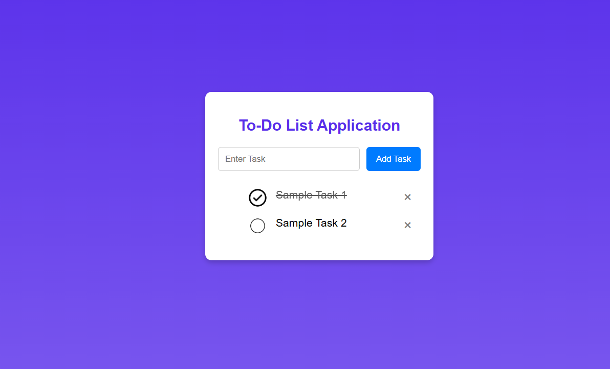

# Task Name - Todo List Application

- Create Todo List Application using DOM Manipulations to create, update, delete list of tasks.

# Elements Learned

| Elements                             | Description                                                                                          |
| ------------------------------------ | ---------------------------------------------------------------------------------------------------- |
| const, let, var                      | Javascript variables                                                                                 |
| `document.getElementById`            | Capture the text entered by user based on `id`                                                       |
| `document.createElement('li')`       | Creates a new html element list items dynamically                                                    |
| `li.innerHTML=id.value`              | Set the content for the created list item                                                            |
| `.appendChild(li)`                   | Used to append the created list item to the html elements                                            |
| `addEventListener()`                 | Allowing them to respond html elements for user actions like clicks, keypresses, or mouse movements. |
| `ev.target.parentElement.remove();`  | Removes the specific elements from the parent html elements.                                         |
| `localStorage.setItem('data',value)` | It stores the value in storage of a browser for later usage.                                         |
| `localStorage.getItem('data')`        | It retrives the stored data from the browser storage.                                                |

# Task Outputs

- The following images demonstrate the functionality of the To-Do List application:

1. Adding a New Task
- When a user enters a task and clicks the "Add Task" button, it appears in the list.

2. Marking a Task as Completed
- Clicking on a task toggles the "completed" state, visually distinguishing it from pending tasks.

3. Deleting a Task
- Users can remove a specific task by clicking the delete button (X).

4. Task Persistence with Local Storage
- Tasks are saved in local storage, ensuring they remain available even after a page refresh.

