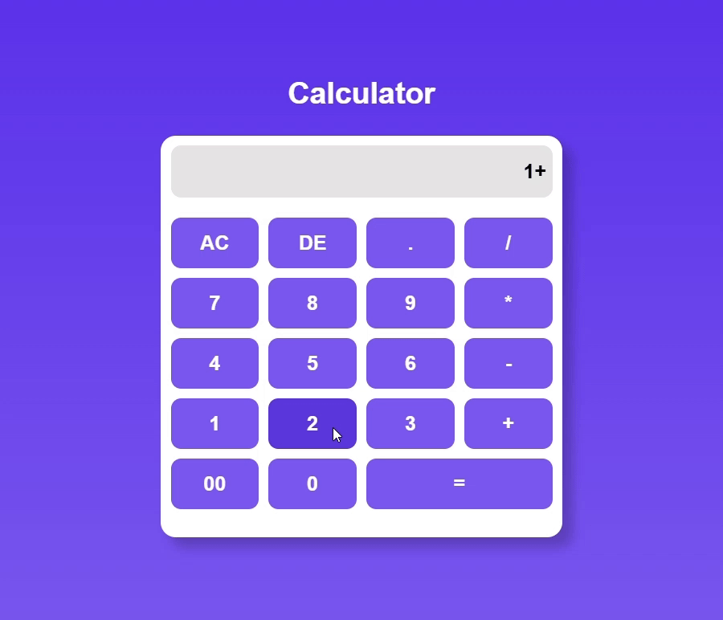

# Task Name - Create a Simple Arithematic Operation Calculator.

- A simple calculator web application that allows users to perform basic arithmetic operations. The calculator provides functionalities such as clearing the display, deleting the last entered value, and evaluating mathematical expressions.

# DOM Elements and Their Purpose

| DOM Element | Selection Method            | Purpose                                    |
| ----------- | --------------------------- | ------------------------------------------ |
| display     | `getElementById("display")` | Shows the user’s input and the result      |
| buttons     | `querySelectorAll(".btn")`  | Stores all number and operator buttons     |
| clearBtn    | `getElementById("clear")`   | Clears the display (AC button)             |
| deleteBtn   | `getElementById("delete")`  | Removes the last character (DE button)     |
| equalBtn    | `getElementById("equal")`   | Evaluates the expression when = is clicked |

# Calculator Demo

