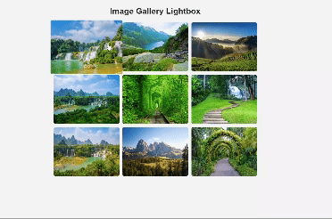

# Task Name - Create a Image Gallery LightBox

- Create a Image Gallery LightBox using HTML, CSS And JavaScript. When the images are clicked it needs to shown in a modal with animation.

# Elements Learned

- Below Javascript code loops throught all the thumnail images. When we click a specific thumbnail, the lightbox becomes visible by setting `disply:flex`. The clicked image source is assgined to the lightboximg and it is visible in lightbox modal.

```
thumbnails.forEach(thumbnail => {
    thumbnail.addEventListener("click", function () {
        lightbox.style.display = "flex"; 
        lightboxImg.src = this.src;
    });
});

```

- If we click anywhere outside the image the lightbox modal is automatically closed. it will check for clicked area is equal to the image area. If not it will close the modal.

```
lightbox.addEventListener("click", function (e) {
    if (e.target !== lightboxImg) {
        lightbox.style.display = "none";
    }
});
```

# DOM Elements And Purpose

| DOM Element   | Selection Method                          | Purpose                                                                   |
| ------------- | ----------------------------------------- | ------------------------------------------------------------------------- |
| `thumbnails`  | `document.querySelectorAll(".thumbnail")` | Selects all thumbnail images in the gallery.                              |
| `lightbox`    | `document.getElementById("lightbox")`     | Selects the lightbox (modal) that appears when an image is clicked.       |
| `lightboxImg` | `document.getElementById("lightbox-img")` | Selects the image inside the lightbox, which will be updated dynamically. |
| `closeBtn`    | `document.querySelector(".close")`        | Selects the close button inside the lightbox                              |


# Task Output

- LightBox Image Gallery


