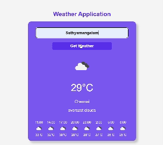

# Task Name - Weather Application Using Weather API

- A simple weather application that fetches current weather and hourly forecast data for a given city using the OpenWeatherMap API. The application displays temperature, weather description, and hourly forecast with icons.

# Working Process

1. Users enters the city name in the input field.
2. By clicking get weather button.

- It fetchs the current weather and forecast data from the OpenWeather API.
- Displays the current temperature and hourly forecast data.

3. If the city is not entered then it shows warning.

# Codeing Explanation

- Selecting Elements using `getElementById()`.

`const tempdivinfo = document.getElementById("temp-div");
const weatherinfodiv = document.getElementById("weather-info");
const weathericon = document.getElementById("weather-icon");
const hourlyforecast = document.getElementById("hourly-forecast");`

- To clear the previsiously displayed data. By clearing the existing data in the html elements.

`
weatherinfodiv.innerHTML = "";
tempdivinfo.innerHTML = "";
hourlyforecast.innerHTML = "";

`

- If the data is not recieved from api then the following code snippet will handle that situation.

`weatherinfodiv.innerHTML = "";
tempdivinfo.innerHTML = "";
hourlyforecast.innerHTML = "";`

- After Fetching the weather data it will etracts the city name, temperature (in Celsius), weather description, and icon code from the response.

`const cityname = data.name;
const temperature = Math.round(data.main.temp - 273.15);
const description = data.weather[0].description;
const iconcode = data.weather[0].icon;
const iconurl =`http://openweathermap.org/img/wn/${iconcode}@4x.png`;
`

- Updating the DOM elements. Uses innerHTML to update temperature and weather details.

`const temperaturehtml =`
${temperature}°C
`;
const weatherhtml = `
${cityname}

${description}
`;
tempdivinfo.innerHTML = temperaturehtml;
weatherinfodiv.innerHTML = weatherhtml;
weathericon.src = iconurl;
weathericon.alt = description;

`

- Extracts the forecast information and updates to the inner html elements.

`next24hours.forEach((item) => {
    const dateTime = new Date(item.dt * 1000);
    const hours = dateTime.getHours();
    const temperature = Math.round(item.main.temp - 273.15);
    const iconcode = item.weather[0].icon;
    const iconurl =`http://openweathermap.org/img/wn/${iconcode}.png`;
const hourlyhtml = `

                            ${hours}:00
                            
                            ${temperature}°C
                        
`;
hourlyforecast.innerHTML += hourlyhtml;
});

`

- The code interacts with DOM elements to fetch data, display results, and update the UI.

- Uses fetch() for API calls and handles both current and forecast weather data.

- Updates the DOM dynamically using innerHTML, src, and alt attributes.

- Uses modular functions to separate different parts of the functionality.

- Implements error handling to manage invalid inputs and failed API responses.

# DOM Elements

| DOM Element ID    | Access Method                                | Manipulation                                             |
| ----------------- | -------------------------------------------- | -------------------------------------------------------- |
| `city`            | `document.getElementById("city").value`      | Retrieves user input for API calls                       |
| `temp-div`        | `document.getElementById("temp-div")`        | Updates temperature using `innerHTML`                    |
| `weather-info`    | `document.getElementById("weather-info")`    | Updates with city name and description using `innerHTML` |
| `weather-icon`    | `document.getElementById("weather-icon")`    | Sets the `src` and `alt` attributes and makes it visible |
| `hourly-forecast` | `document.getElementById("hourly-forecast")` | Appends forecast items using `innerHTML`                 |

# Task output

- Demo of the Working weather APPlication

