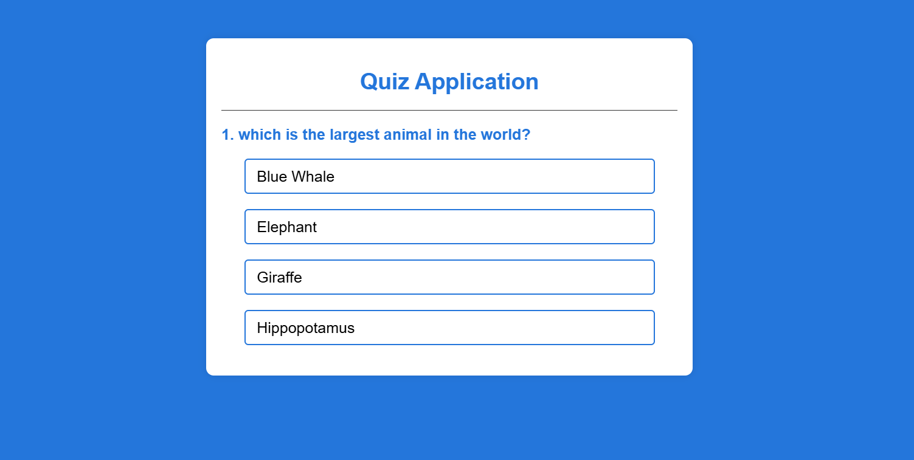
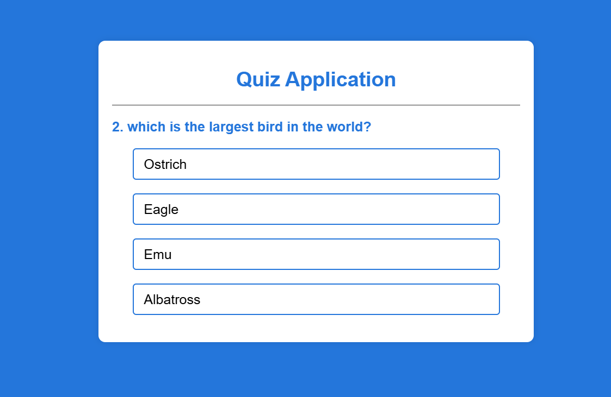
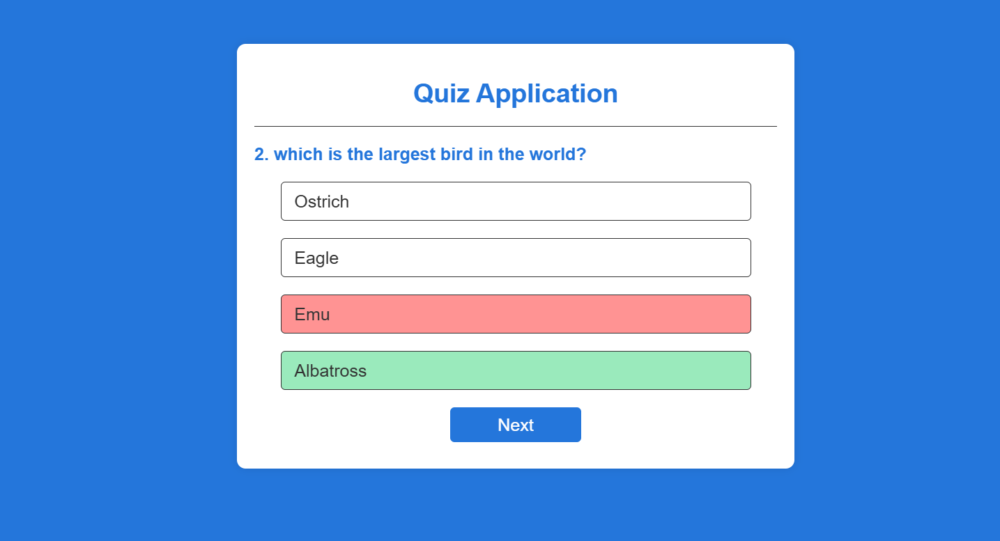
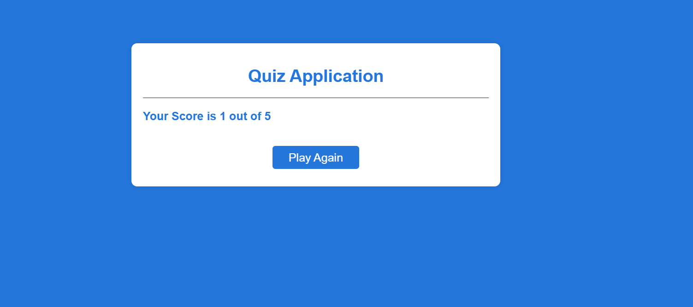

# Task Name - Simple Quiz Application

- Create a quiz app that dynamically loads questions and tracks user scores. After completing the test show the final score.

# Step by Step Explanation

1. startQuiz()

-  Initializes the quiz by resetting the current question index and score, then displays the first question.
- Resets currentQuestionIndex and score to 0.
- Sets the "Next" button text.
- Calls the showQuestion() function to display the first question.

```
function startQuiz() {
  currentQuestionIndex = 0;
  score = 0;
  nextButton.innerHTML = "Next";
  showQuestion();
}

```
- Output of Displaying a First question.



2. showQuestion()

- Displays the current question and its answer options.
- Calls resetState() to clear the previous question and answers.
- Retrieves the current question from the questions array.
- Updates the questionElement with the question text.
- Loops through the answers and creates a button for each.
- Adds a click event listener to each button to call selectAnswer() when clicked.
- Sets a data attribute (data-correct) on correct answer buttons.

```
function showQuestion() {
  resetState();
  let currentQuestion = questions[currentQuestionIndex];
  let questionno = currentQuestionIndex + 1;
  questionElement.innerHTML = questionno + ". " + currentQuestion.question;

  currentQuestion.answers.forEach((answer) => {
    const button = document.createElement("button");
    button.innerHTML = answer.text;
    button.classList.add("btn");
    answerButtonsElement.appendChild(button);
    if (answer.correct) {
      button.dataset.correct = answer.correct;
    }

    button.addEventListener("click", selectAnswer);
  });
}
```

- Output of Displaying the next question by clearing the first question displayed.



3. resetState()

- Clears the previous question and hides the "Next" button.
- Removes all answer buttons from the `answerButtonsElement` container using a `while` loop.

```
function resetState() {
  nextButton.style.display = "none";
  while (answerButtonsElement.firstChild) {
    answerButtonsElement.removeChild(answerButtonsElement.firstChild);
  }
}
```

4. selectAnswer(e)

- Gets the clicked button and checks whether the answer is correct using the data-correct attribute.
- Adds CSS classes (correct or incorrect) to indicate correctness.
- Disables all buttons to prevent multiple selections.
- Shows the correct answer by adding the correct class to it.
- Increments the score if the selected answer is correct.
- Displays the "Next" button.

```
function selectAnswer(e) {
  const selectedButton = e.target;
  const iscorrect = selectedButton.dataset.correct === "true";
  if (iscorrect) {
    selectedButton.classList.add("correct");
    score++;
  } else {
    selectedButton.classList.add("incorrect");
  }

  Array.from(answerButtonsElement.children).forEach((button) => {
    if (button.dataset.correct === "true") {
      button.classList.add("correct");
    }
    button.disabled = true;
  });
  nextButton.style.display = "block";
}
```

- Below image shows once the option is choosed and its correctness state.



5. showScore()

- Displays the user's total score at the end of the quiz.
- Calls resetState() to clear previous question data.
- Updates the questionElement to show the final score.
- Changes the "Next" button text to "Play Again".
- Displays the "Next" button.

```
function showScore() {
  resetState();
  questionElement.innerHTML = "Your Score is " + score + " out of " + questions.length;
  nextButton.innerHTML = "Play Again";
  nextButton.style.display = "block";
}

```
- Below image shows the result of quiz with score.



6. handleNextButton()

- Handles the transition to the next question or displays the score when the quiz ends.
- Increments currentQuestionIndex.
- Calls `showQuestion()` if more questions remain.
- Calls `showScore()` if the quiz is over.

```
function handleNextButton() {
  currentQuestionIndex++;
  if (currentQuestionIndex < questions.length) {
    showQuestion();
  } else {
    showScore();
  }
}
```

7. Event Listener for Next Button

- Handles "Next" button clicks to move to the next question or restart the quiz.
- Checks whether more questions are available.
- Calls `handleNextButton()` or `startQuiz()` accordingly.