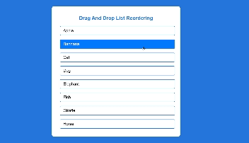

# Task Name - Drag And Drog List Reordering

- Create a list of items that should be draggable and modify the list item order.

# Drag and Drog Elements

| Elements   | Access Method                                             | Purpose                                                          |
| ---------- | --------------------------------------------------------- | ---------------------------------------------------------------- |
| Drag Start | `element.addEventListener("dragstart", handleDragstart);` | Initiates the drag operation and sets data being dragged.        |
| Drag Over  | `element.addEventListener("dragover", handleDragover);`   | Allows the drop by preventing the default behavior.              |
| Drag Enter | `element.addEventListener("dragenter", handleDragEnter);` | Provides visual feedback when entering a valid drop target.      |
| Drag Leave | `element.addEventListener("dragleave", handleDragLeave);` | Removes visual feedback when leaving a drop zone.                |
| Drop       | `element.addEventListener("drop", handleDrop);`           | Swaps the dragged item's content with the drop target's content. |
| Dragend    | `element.addEventListener("dragend", handleDragEnd);`     | Cleans up visual feedback after the drag operation.              |


# Step By Step Explanation

1. Drag Start (dragstart)

- Initiates the drag operation.
- Sets the data being dragged and provides visual feedback (like opacity or highlighting).
- Makes the item draggable.
- `this` refers to the element being dragged.
- `e.dataTransfer` is the data transfer object for setting and getting dragged data.
- `effectAllowed` specifies allowed operations, such as "move" or "copy".
- `setData` stores the data being dragged, useful when moving or copying data.

```
function handleDragstart(e) {
    draggedItem = this;
    this.classList.add("dragging");
    e.dataTransfer.effectAllowed = "move";
    e.dataTransfer.setData("text/plain", this.innerHTML);
}
```

2. Drag Over (dragover)

- Allows the drop by preventing the default behavior.
- Indicates that the dragged item can be dropped here.
- Provides visual feedback, like changing the background color or border.
- `e.preventDefault()` is crucial to enable dropping.
- `dropEffect` defines how the cursor looks during drag (like a move icon).

```
function handleDragover(e) {
    e.preventDefault();
    this.classList.add("drag-over");
    e.dataTransfer.dropEffect = "move";
}
```

3. Drag Enter (dragenter)

- Provides visual feedback when the dragged item enters a valid drop target.
- this refers to the potential drop target.
- Adding a class (like drag-over) highlights the item, indicating it’s a valid drop zone.

```
function handleDragEnter(e) {
    e.preventDefault();
    if (this !== draggedItem) {
        this.classList.add("drag-over");
    }
}

```

4. Drag Leave (dragleave)

- Removes visual feedback when the dragged item leaves a drop zone.
- Simply removes the added visual class to indicate that the dragged item is no longer over the element.

```
function handleDragLeave() {
    this.classList.remove("drag-over");
}
```

5.  Drop (drop)

- Handles the final drop operation.
- Swaps the dragged item's content with the drop target’s content.
- `e.stopPropagation()` prevents other drag/drop handlers from interfering.
- Uses `innerHTML` swapping to visually move items.
- Ensures that the dragged item and the drop target are not the same.

```
function handleDrop(e) {
    e.stopPropagation();
    this.classList.remove("drag-over");

    if (draggedItem !== this) {
        const draggedHTML = draggedItem.innerHTML;
        draggedItem.innerHTML = this.innerHTML;
        this.innerHTML = draggedHTML;
    }

    return false;
}

```

6. Drag End (dragend)

- Cleans up visual feedback and resets styles after the drag operation is complete.
- Removes the dragging class to return the item to its original state.
- Iterates over all items to ensure no lingering visual feedback.

```
function handleDragEnd() {
    this.classList.remove("dragging");
    list.querySelectorAll(".list-item").forEach((item) => item.classList.remove("drag-over"));
}

```

# Task Demo

