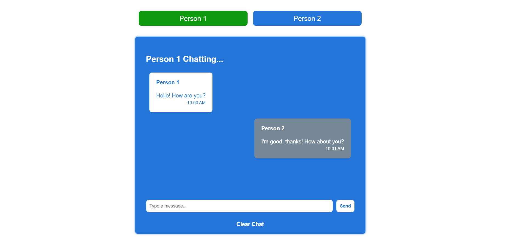

# Task Name - Create a Chat Simulation without Backend

- Creating a realtime chat simulation without backend. Efficiently handling the user-input and updates the chat dynamically with timestamp.

# Step By Step Process

1. Selecting the DOM Elements

```
const person1selector = document.querySelector("#contact1-selector");
const person2selector = document.querySelector("#contact2-selector");
const chatHeader = document.querySelector(".chat-header");
const chatMessages = document.querySelector(".chat-messages");
const chatInputBox = document.querySelector(".chat-input-box");
const chatInput = document.querySelector(".chat-input");
const clearChatButton = document.querySelector(".clear-button");
```

- `person1selector` and `person2selector`- Buttons to switch between Person 1 and Person 2.
- `chatHeader`- Displays the current chatting person.
- `chatMessages` - Container where chat messages are displayed.
- `chatInputBox` - Input field to type a message.
- `chatInput` - Form that wraps the input box and send button.
- `clearChatButton` - Button to clear the chat.

- Chat Interface




2. Storing and Retrieving Messages from Local Storage

```
const messages = JSON.parse(localStorage.getItem("messages")) || [];
```

- Uses `localStorage.getItem()` to get the stored messages.
- If messages exist, it parses them from a JSON string to an array.
- If no messages are found, it initializes with an empty array.

3. Creating a Chat Message Element Dynamically

```
const createChatMessageElement = (message) => `
  <div class="message ${
    message.sender === "Person 1" ? "white-bg" : "gray-bg"
  }">
    <div class="message-sender">${message.sender}</div>
    <p class="message-text">${message.text}</p>
    <span class="message-timestamp">${message.timestamp}</span>
  </div>
`;
```

- It generates an HTML string for a single chat message.
- Uses a conditional statement to apply different background colors based on the sender.
- Each message contains:
    1. The sender's name.
    2. The message text.
    3. The timestamp of when the message was sent.


- Messages Stored in localstorage and same message apperaing in the chat interface.


4. Displaying the Saved Message while Reloading the page.

```
window.onload = () => {
  messages.forEach((message) => {
    chatMessages.innerHTML += createChatMessageElement(message);
  });
};
```

- Uses the window.onload event to ensure the code runs after the page is fully loaded.
- Loops through each saved message and appends it to the chat messages container.

5. Switching Between Users

```
const updateMessageSender = (name) => {
  messageSender = name;
  chatHeader.innerText = `${messageSender} chatting ...`;
  chatInput.placeholder = `Type a message to ${messageSender}`;

  if (name === "Person 1") {
    person1selector.classList.add("active-person");
    person2selector.classList.remove("active-person");
  }
  if (name === "Person 2") {
    person2selector.classList.add("active-person");
    person1selector.classList.remove("active-person");
  }
  chatInput.focus();
};
```

- Changes the global `messageSender` variable to the selected person's name.
- Updates the chat header to reflect the active person.
- Changes the button appearance using CSS classes to indicate the active person.
- Sets the focus on the chat input field.

- Event hanlders for switching users

```
person1selector.onclick = () => {
  updateMessageSender("Person 1");
};

person2selector.onclick = () => {
  updateMessageSender("Person 2");
};

```

- Person 1 (User 1) View


- Person 2 (User 2) View


6. Sending a Message

```
const sendMessage = (e) => {
    e.preventDefault();
    const timestamp = new Date().toLocaleTimeString([], {
      hour: "2-digit",
      minute: "2-digit",
      hour12: true,
    });
  
    const message = {
      sender: messageSender,
      text: chatInputBox.value,
      timestamp,
    };
  
    messages.push(message);
    localStorage.setItem("messages", JSON.stringify(messages));
    chatMessages.innerHTML += createChatMessageElement(message);
    chatMessages.scrollTop = chatMessages.scrollHeight;
    chatInputBox.value = ""; 
};
```

- Uses `e.preventDefault()` to prevent the form from refreshing the page.
- Gets the current timestamp in a human-readable format.
- Creates a message object with:
    1. `sender`: The current person sending the message.
    2. `text`: The message typed in the input box.
    3. `timestamp`: The current time.

- Adds the message to the messages array and saves it to Local Storage.
- Appends the new message to the chat window.
- Scrolls to the latest message.
- Clears the input box.

- Person 1 Chat Typing and Sending view


7. Clearing the Chat

```
clearChatButton.addEventListener("click", () => {
  localStorage.removeItem("messages");
  chatMessages.innerHTML = "";
  messages.length = 0;
});

```

- Removes stored messages from Local Storage.
- Clears the chat messages displayed on the screen.
- Empties the messages array.

