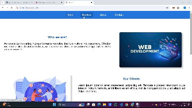

# Task Name - Single-Page Application (SPA) with Hash-based Routing

- Create a single page application that navigates between different pages without re-loading the page. Use Hash-based Routing to navigate or load the content of the different pages.

# What is SPA ?

- It loads a single HTML page and dynamically updates the page content without reloading the whole page.
- It provides soomth user experience.

# What is Hash-Based Routing ?

- Hash-Based routing is a technique which is used to navigate different pages or dynamically loads the content without reloading the whole page.
- It helps to identify the route they we are currently viewing.
- It uses URL hash fragment to identify the route and loads the content.

# Step By Step Explanation

1. Project Started with `.html` files.

- Created a `index.html` file only with navigation bar, main content area and footer.
- Created a separate files for each page that present in the navigation menu.

```
<nav>
    <ul>
        <li><a href="#/" onclick="route()">Home</a></li>
        <li><a href="#/services" onclick="route()">Services</a></li>
        <li><a href="#/about" onclick="route()">About</a></li>
        <li><a href="#/contact" onclick="route()">Contact</a></li>
    </ul>
</nav>

```

- In the above code `href` tags contains a `onclick` function. When user clicks the particular navigation menu then it triggers the route function.

2. Route Function

```
const route = (event) => {
    event = event || window.event;
    event.preventDefault();
    const href = event.currentTarget.getAttribute("href");
    window.location.hash = href;
    handleLocation();
};
```

- Route function will be triggered when the navigation links is clicked.
- `event = event || window.event;` - Ensures compatibility by using the event from the function parameter or the global window event.
- `event.preventDefault();` - Prevents the default behavior of the anchor tag (page reload).
- Gets the `href` attribute of the clicked link.
- `window.location.hash = href;` - Updates the URL hash without reloading the page (e.g., changes URL to http://localhost/#/services).
- `handleLocation();` - Calls the function that handles the content loading based on the new hash.

3. Predefined routes

```
const routes = {
    "/": "Home",
    "/services": "Services",
    "/about": "About",
    "/contact": "Contact"
};

```

- An object that maps each route path (like` /services`) to a corresponding page name (like `"Services"`).

4. HandelLocation Function

```
const handleLocation = async () => {
    const path = window.location.hash.replace("#", "") || "/";
    const route = routes[path] || "Home";
    try {
        const response = await fetch(`./pages/${route}.html`);
        if (!response.ok) throw new Error("Page not found");
        const html = await response.text();
        document.getElementById("content").innerHTML = html;
        document.title = route;
    } catch (error) {
        document.getElementById("content").innerHTML = `<h1>404 - Page Not Found</h1>`;
        console.error(error);
    }
};

```

```
const path = window.location.hash.replace("#", "") || "/";
```

- The above line of code will retrieves the hash from the url. If there is no hash then by default home page contents are loaded.

```
const route = routes[path] || "Home";
```

- The above line will finds the corresponding page name from the `routes` object.

```
const response = await fetch(`./pages/${route}.html`);
if (!response.ok) throw new Error("Page not found");

```
- Dynamically loads the HTML file from the `pages/` directory.
- Handles the error if the page content not found.

5. Displaying the content

```
const html = await response.text();
document.getElementById("content").innerHTML = html;
document.title = route;
```

- After finiding the page content from pages directory it will be updated to main content section and also title of page is updated based on the content got for particular page.

7. Event listener for Hash Change

```
window.addEventListener("hashchange", handleLocation);
```

- Listens for changes in the URL hash (like moving from `#/about` to `#/services`).
- When the hash changes, it calls the `handleLocation` function to load the corresponding page.

```
handleLocation();
```

- It helps to load the initail contents for the webpage


# Task Output

